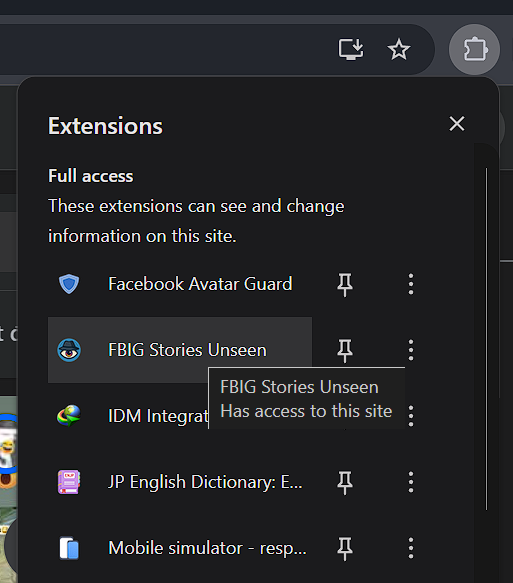
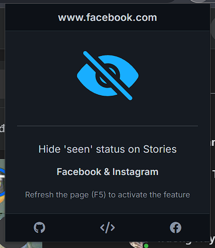

<p align="center"><a href="https://github.com/DuckCIT/FBIG-Stories-Unseen" target="_blank" rel="noreferrer noopener"></a></p>
<p align="center">FBIG Stories Unseen helps you stay invisible while watching Stories on Facebook and Instagram — <strong>preventing the "seen" status</strong> from being sent, so others won't know you've viewed their Stories.</p>

<h2 align="center">FBIG Stories Unseen</h2>
<br/>
<p align="center">FBIG Stories Unseen is an <strong>open-source</strong> MIT-licensed <strong>browser extension</strong> that allows you to view Facebook and Instagram Stories without marking them as "seen", giving you more privacy while browsing.</p>

## Installation

1. **Clone the Repository** (or **`Download ZIP`**):
    ```bash
    git clone https://github.com/DuckCIT/FBIG-Stories-Unseen.git
    ```
2. **Load the Extension:**
   - Open `chrome://extensions/` (Chrome), `about:debugging#/runtime/this-firefox` (Firefox), or `edge://extensions/` (Edge).
   - Enable **Developer Mode** (Chrome/Edge) or click **Load Temporary Add-on** (Firefox).
   - Select **Load Unpacked** (Chrome/Edge) or choose the `manifest.json` file (Firefox) from the project folder.
3. **Launch**: Look for the FBIG Stories Unseen icon in your browser toolbar.

## How to Use

### Hiding "Seen" Status on Stories
1. Click the **FBIG Stories Unseen** icon in your browser toolbar. <p align="center"></p>
2. Toggle the **'Eye Off' icon** option to activate the feature. <p align="center"></p>

### Viewing Stories Unseen
Once the extension is activated, you can freely view Stories without the poster knowing that you've seen them.

## License
This project is licensed under the MIT License. See the file for details.

## Contributing
FBIG Stories Unseen is a solo project by Nguyen Trong Duc, built for personal use and shared with the community. As a single developer, I’d love your help to make it even better! You can contribute by:
- Reporting bugs or suggesting new features on [GitHub Issues](https://github.com/DuckCIT/FBIG-Stories-Unseen/issues).
- If you're a developer, feel free to fork the repo and submit pull requests.
---
